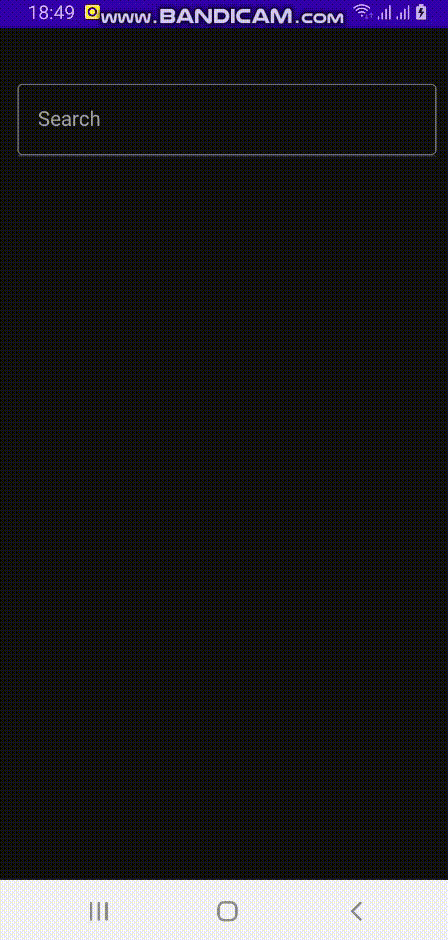
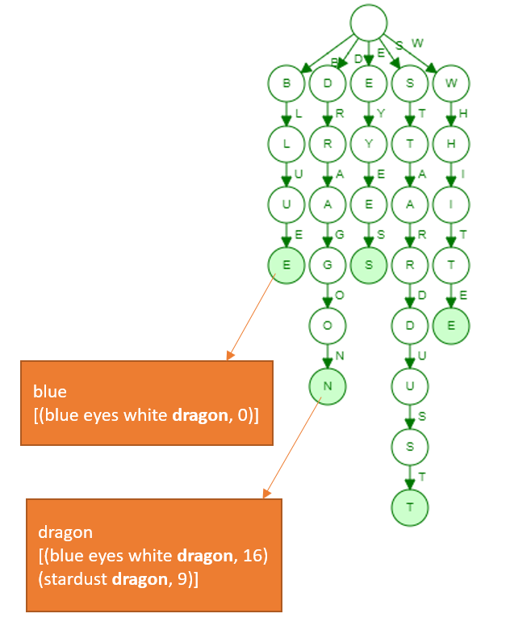

# Yugioh Card Dict with Jetpack Compose, Autocomplete, Kotlin, Trie

A sample Android application to demonstrate Jetpack Compose autocomplete, Searching on Trie data structure by Kotlin for learning purpose

 / 

## Table of Contents

- [Logic](#logic)
- [External libs](#external-libs)  
- [Contributing](#sample-data)
- [License](#license)

## Logic

When app launch, read cards.csv and create records (id, title, image url) indexed by id in a hashmap, also tokenize each title into tokens (with position), generate inverted index and insert token into a trie.

Example of tokenizing: 
```
Blue Eyes White Dragon ---> [(blue,0), (eyes, 5), (white, 10), (dragon, 16)]
Stardust Dragon ---> [(stardust, 0), (dragon, 9)]
```
Trie and inverted index visualization:



When searching with debounce 0.5s, the input string will be tokenized and be looked up on Trie. [Trie data structure](https://en.wikipedia.org/wiki/Trie) can help to look up data faster in the worst case. All matched records will be ranked and inserted into a Priority queue 

Title which is matched more token, contained less token, leftmost matched is higher ranked. In general, formula could be understand by: rank = 1000 * matched_token + 100 * (10 - total_token) + (100 - token_position) (Assumed total_token <= 10, token_position <= 100)

This nano-pet project is for learning purpose. In real world searching problem, we should consider to leverage an opensource search engine or self-implement a lite searching function.

## External libs

[Opencsv for reading csv](http://opencsv.sourceforge.net/)
[Coil on Compose for loading image](https://coil-kt.github.io/coil/compose/)

## Sample data

I've included assets/cards_sample.csv for references. For full data, please sign up Kaggle and download into assets/cards.csv
[Yu-Gi-Oh! Cards dataset at Kaggle by Antonio](https://www.kaggle.com/ioexception/yugioh-cards)

## Maintainers

[@Khang Yang](https://github.com/chungvinhkhang).

## License

© Khang Yang